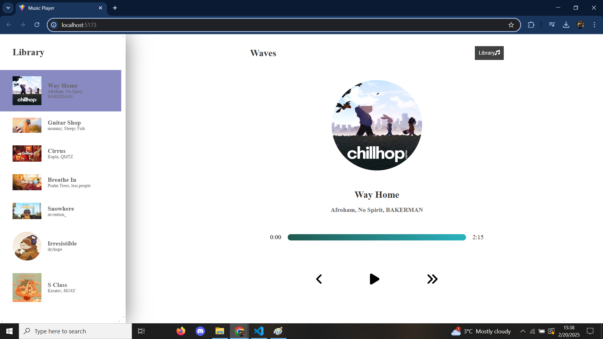
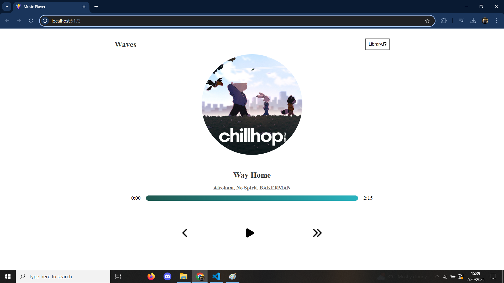

# Music-Player
The Music Player is a modern web-based audio player built using React, JavaScript, Vite, SCSS, and HTML. It leverages Vite for fast development and optimized performance, ensuring a smooth and efficient user experience. The application features a fully responsive design, adapting seamlessly to different screen sizes for both desktop and mobile users. It uses React components for a modular architecture, while SCSS enhances styling flexibility and maintainability. With a clean UI and intuitive controls, this music player provides an easy and lightweight way to play and manage audio files.

## 🔥 Preview

